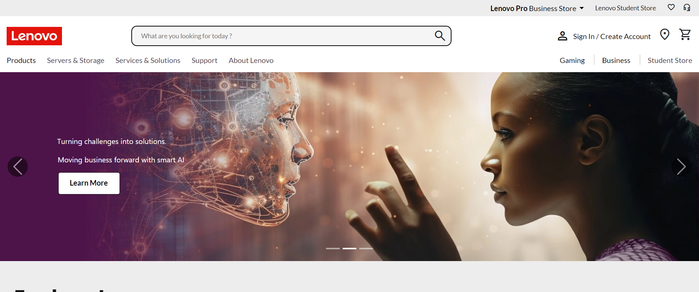
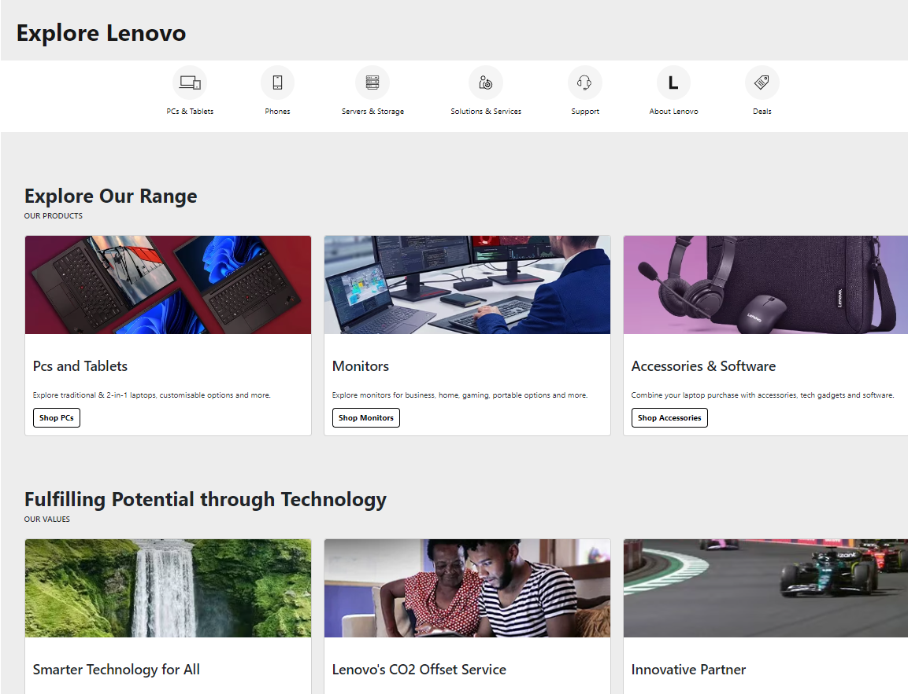
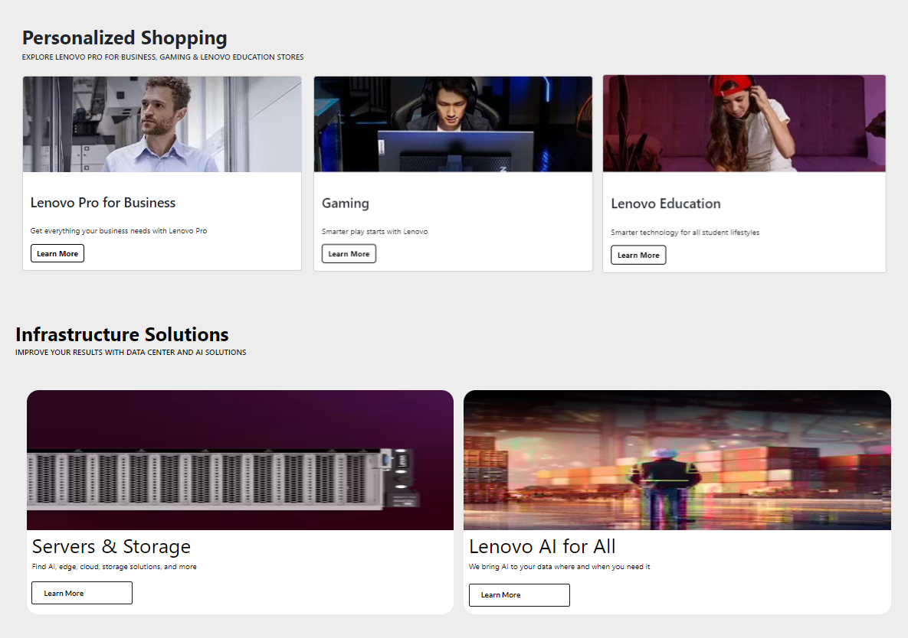
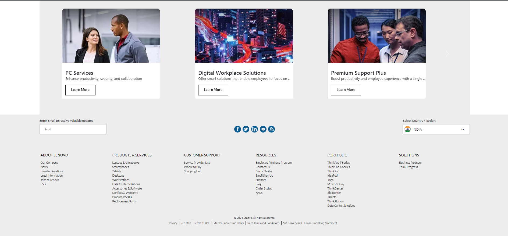
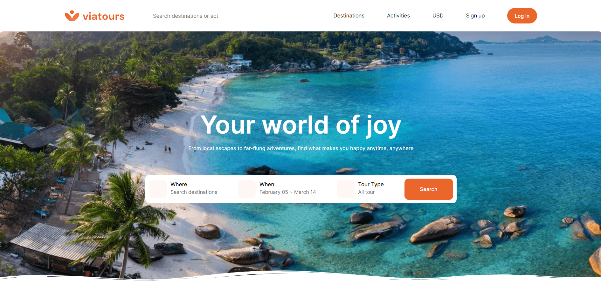
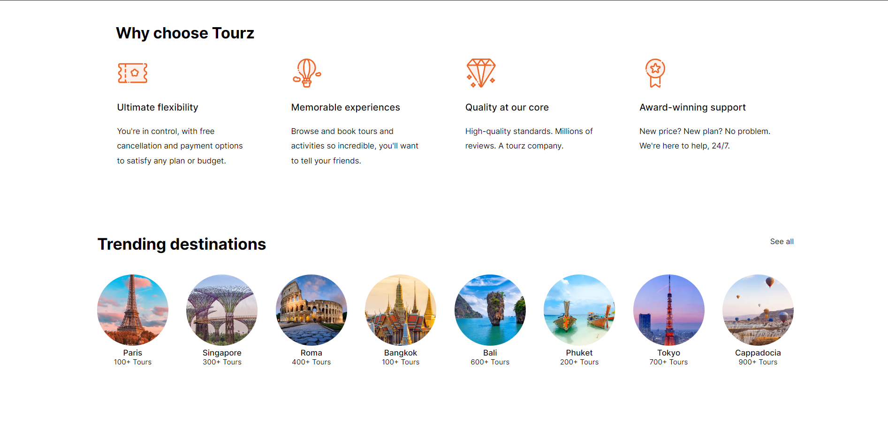
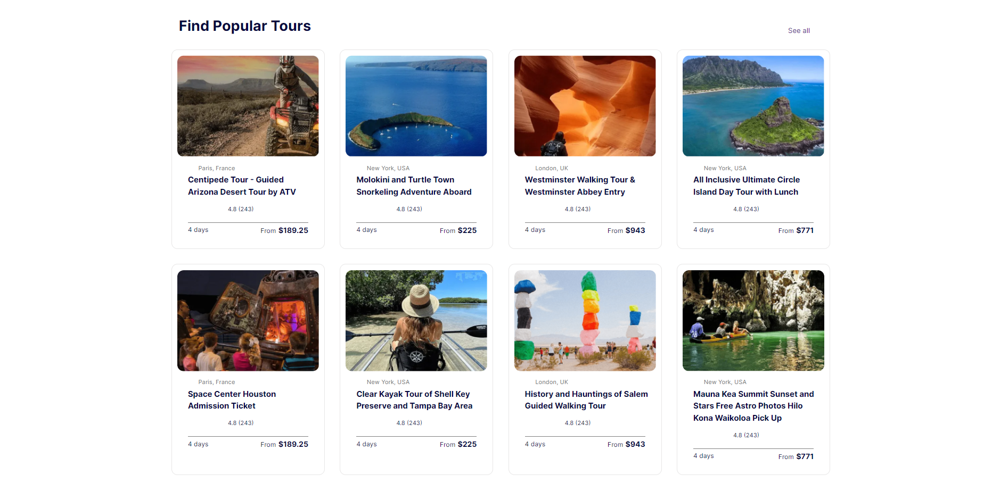
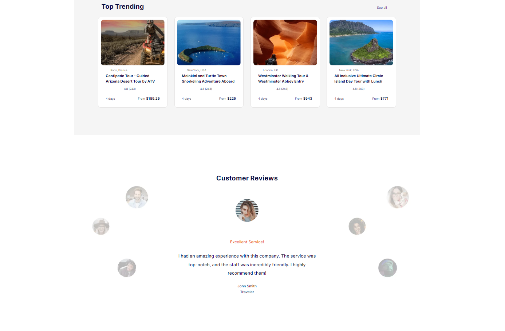
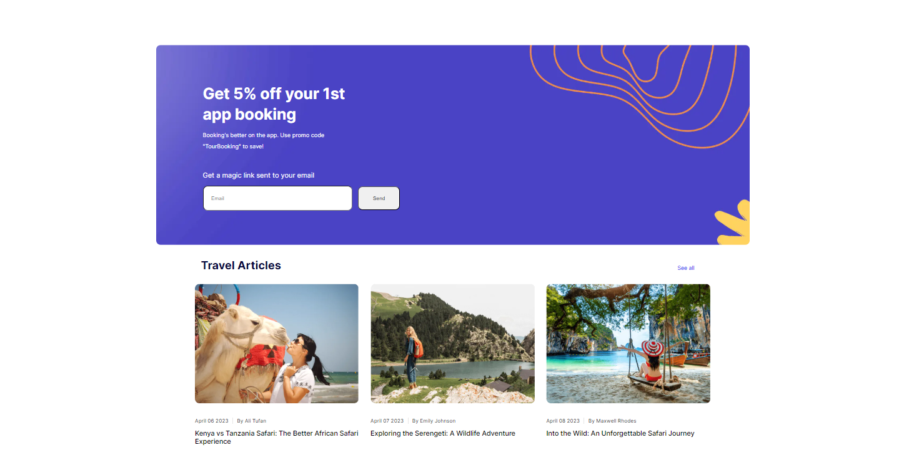

## Code-Kalyaan

### Lenovo

Lenovo's website is useful for marketing and selling a wide range of consumer electronics, personal computers, software, business solutions, and related services It incorporated heading contains different options that uses navbar different carousal that uses bootstrap, flex layout, footers.

### Viatours

Viatours is a web component designed to provide a sleek and dynamic user experience for exploring travel options. It has also a header a search bar different section for exploring tours options and explore others such as popular tours destination ,popular things to do, travel articles they utilizes grid layout and made with help of scss to incorporated smooth experience in styling

### Deployed Link

[Live Demo Lenovo](https://lenovo-code-kalyaan.netlify.app/) 
[Live Demo Viatours](https://viatours-code-kalyaan.netlify.app/)

### Screenshots

#### Lenovo Desktop View

### Viatours Deskstop View

## Features

- **Navbar and Footer**: Both have a fixed height of 100px each, providing consistent navigation and information throughout the page.
- **Dynamic Design**: A single-page component with fluid layout adjustments to accommodate different screen sizes, ensuring a seamless user experience.
- **Image with Overlay Text**: An image positioned between the navbar and footer, with translucent overlay text for added visual appeal.
- **Alert Button**: Functionality to trigger an alert message upon clicking, enhancing user interaction.
- **Title and Banner**: Centered on the page and overlay, providing a focal point for the content.
- **Responsive Hamburger Menu**: Ensures accessibility and ease of navigation on smaller devices.

## Tech Stack

- **HTML**: Provides the structure and content for the web page.
- **CSS**: Handles the UI and styling, ensuring an appealing visual presentation.
- **SCSS**: SCSS is a CSS preprocessor that adds functionality like variables, nesting, and mixins

### Design Elements

1. **Media Queries:**
   Media queries are utilized to ensure the website's responsiveness across various screen sizes. By adjusting the layout and styling dynamically, the website offers an optimal viewing experience on different devices.

2. **Keyframes:**
   Keyframes are employed to create captivating animations within the website. By defining specific animation steps, keyframes enhance user engagement and interaction, providing a seamless browsing experience.

3. **Bootstrap:**
   Bootstrap is a popular HTML, CSS, and JS framework for developing responsive, mobile-first projects on the web. It features a grid system, components, and utilities for faster web design

4. **Responsive Design:**
   Utilizes media queries and flex layouts to adapt the page layout across various devices, ensuring a seamless browsing experience on mobile phones, tablets, and desktop computers.

5. **Fonts & Icons:**
   Integrates Google Fonts and FontAwesome icons for enhanced typography and visual elements. By leveraging these resources, the website achieves a modern and visually appealing design, improving readability and user engagement.

## How to Use

To run this project locally:

1. Clone this repository to your local machine.
2. Open the `index.html` file in your preferred web browser.
3. Explore the Lenovo and Viatours experience right from your device.

## Contributors

- [Aditya Kumar Singh](https://github.com/adityaks-lts)
- [Mohammad Tehreem](https://github.com/mohammadtehreem)
- [Soumyadeep Dutta](https://github.com/soumyadeepdutta7)
- [Rameshwar Bedade](https://github.com/rambedade)
- [Sanpreet Singh](https://github.com/Sanpreet0415)

## License

This project is licensed under the MIT License - see the [LICENSE](LICENSE) file for details.

## Acknowledgments

- Inspired by the beauty of travel and exploration.
- Special thanks to the supportive community at [Travelopia].
