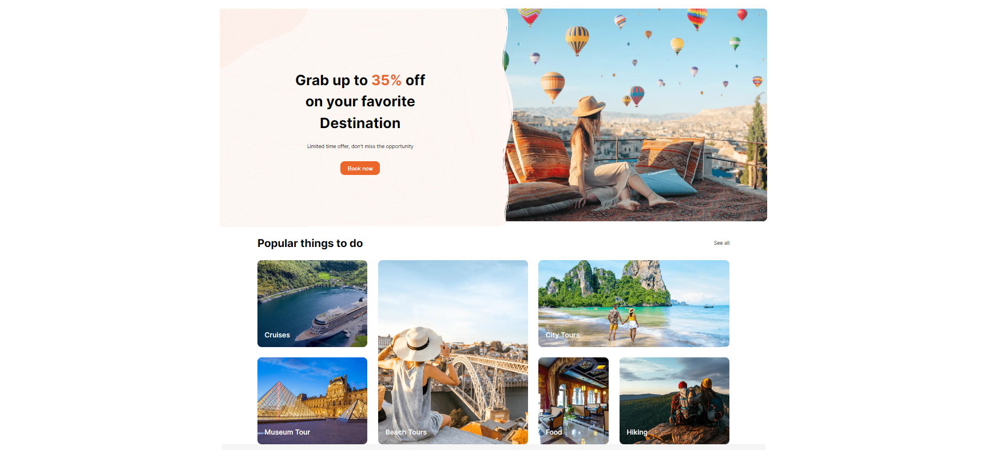
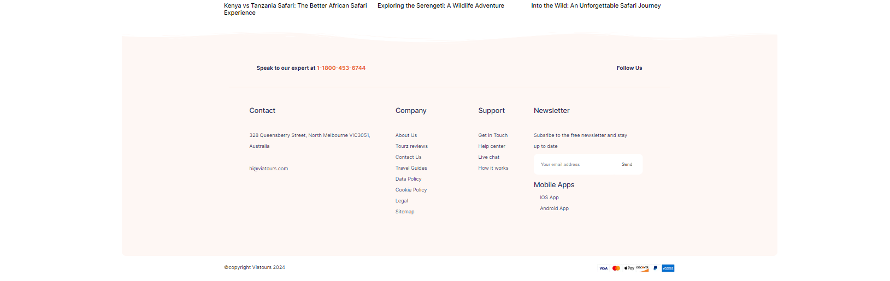

## Code-Kalyaan

#### Lenovo

Lenovo's website is useful for marketing and selling a wide range of consumer electronics, personal computers, software, business solutions, and related services It incorporated heading contains different options that uses navbar different carousal that uses bootstrap, flex layout, footers.

#### Viatours

Viatours is a web component designed to provide a sleek and dynamic user experience for exploring travel options. It has also a header a search bar different section for exploring tours options and explore others such as popular tours destination ,popular things to do, travel articles they utilizes grid layout and made with help of scss to incorporated smooth experience in styling

### Project Type

Frontend

### Deployed Link

[Live Demo Lenovo](https://lenovo-code-kalyaan.netlify.app/) 
[Live Demo Viatours](https://viatours-code-kalyaan.netlify.app/)

### Directory Structure

Code-Kalyan/ 
├─ Lenovo/ 
│ ├─... 
├─ screenshots/ 
│ ├─... 
├─ Viatours/ 
│ ├─content 
│ ├─... 

### Video Walkthrough of the project

[Presentation Link](https://www.youtube.com/watch?v=ki63liGzw14)

### Questionnaires related to project

[Youtube Playlist Link](https://www.youtube.com/playlist?list=PLmWQz0Sx2H8t9EouBoi6DiV0q1aUCdB_e)

### Screenshots

#### Lenovo Desktop View

### Viatours Deskstop View

## Features

- **Navbar and Footer**: Both have are interactive , providing consistent navigation and information throughout both of the pages.
- **Carousel**: A responsive slideshow for cycling images or text, with controls and indicators.
- **Dropdown**: Bootstrap dropdowns offer toggleable menus with dynamic positioning, accessibility support, and are customizable to fit various needs and branding provide user a variety of options with in a button
- **Cards**: It used in main content of lenovo website. Bootstrap cards enhance user experience by providing a clean, flexible container for content that’s easy to navigate and visually appealing.
- **Interactive**: Card will increase in sized in a smooth way when curser hover them also the button changes the colors and in header the dropdown menu comes up and a red underline comes when user interact with it.
- **Background**: Many of the elements utilizes background image feature to give an appealing and unique look to each of different elements.
- **Flex and Grid**: Many of the elements takes the benefits of display flex and display grid to provide more control over the deferent layout in different sections of website.

## Tech Stack

- **HTML**: Provides the structure and content for the web page.
- **CSS**: Handles the UI and styling, ensuring an appealing visual presentation.
- **SCSS**:Used in a CSS preprocessor that adds functionality like variables, nesting, and mixins.
- **Bootsrap**:It is used for front-end framework for creating responsive and mobile-first websites. It simplifies web development with HTML, CSS, and JS components and tools

### Design Elements

1. **Bootstrap:**
   Bootstrap is a popular HTML, CSS, and JS framework for developing responsive, mobile-first projects on the web. It features a grid system, components, and utilities for faster web design

2. **Fonts & Icons:**
   Integrates Google Fonts and FontAwesome icons for enhanced typography and visual elements. By leveraging these resources, the website achieves a modern and visually appealing design, improving readability and user engagement.

3. **Figma:**
   It is used a web-based UI/UX design app that enables collaborative, browser-based graphic design and prototyping with a generous free plan for how the website will look and what functionality it will have.

## How to Use

To run this project locally:

1. Clone this repository to your local machine.
2. Open the `index.html` file in your preferred web browser.
3. Explore the Lenovo and Viatours experience right from your device.

## Contributors

- [Aditya Kumar Singh](https://github.com/adityaks-lts)
- [Mohammad Tehreem](https://github.com/mohammadtehreem)
- [Soumyadeep Dutta](https://github.com/soumyadeepdutta7)
- [Rameshwar Bedade](https://github.com/rambedade)
- [Sanpreet Singh](https://github.com/Sanpreet0415)

## License

This project is licensed under the MIT License - see the [LICENSE](LICENSE) file for details.

## Acknowledgments

- Inspired by Lenovo original website.
- Special thanks to the our mentor/IA [Rahul Rajeevan Sir](https://github.com/Rahul-Rajeevan) for giving us directions and material for this project.
